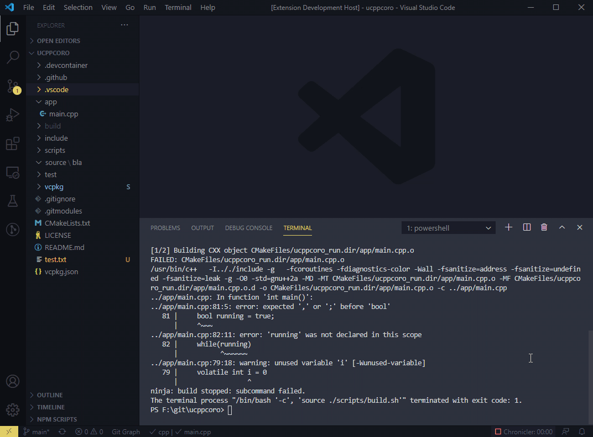

# Just let me click this freaking paths
Click relative paths starting at the './build' directory

## Background
When you use CMake and Ninja with GCC you get relative paths starting at the './build' directory. You can specify the path for the Problem Matcher of your VSCode task, but this does not influence the behavior of the integrated terminal.   
An option would be to use absolute paths, but there is no option for it, weather in CMake, nor in Ninja nor in GCC. Besides using absolute paths with Ninja breaks custom CMake header dependencies (2020-11-15) (for example a generated header file is dependent on a .json file).   
To be able to still click the relative paths in the integrated terminal, this extension is born.

## Demo

